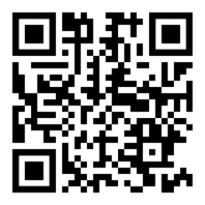

# Introduzione al corso

## Docenti e Tutor

### Turno C (Cognomi da "L" a "Pa")

Docente: Alessandro D'Amelio

Email: alessandro.damelio@unimi.it

Ufficio: 4022 (ricevimento su appuntamento)

Tutor: Luca Favini

### Turno D (Cognomi da "Pe" a "Z")

Docente: Lorenzo Capra

Email: lorenzo.capra@unimi.it

Ufficio: 5052 (ricevimento su appuntamento)

Tutor: Federico Bruzzone

## Lezioni

### Orario e Calendario

Orario: Ogni Lunedì, dalle 14.00 alle 17.30

| OTTOBRE | NOVEMBRE | DICEMBRE | GENNAIO |
|:-------:|:--------:|:--------:|:-------:|
| 6       | 3        | 1        | 12      |
| 13      | 10       | 15       |         |
| 20      | 17       |          |         |
| 27      | 24       |          |         |
|         |          |          |         |

**Attenzione**: sono possibili variazioni; controllare periodicamente il canale Telegram.

### Aule

Turno C: Aula OMEGA Labc [Informatica - Celoria 18]

Turno D: Aula TAU Labc [Informatica - Celoria 18]

## Informazioni

### Pagine di riferimento

Pagina del corso: [Prof. Cazzola (teoria)](https://cazzola.di.unimi.it/prog.html) https://cazzola.di.unimi.it/prog.html

Esercizi: [Github](https://github.com/LabProgrammazione1/Lab_2025-26) --> https://shorturl.at/wZHWX

### Comunicazioni

[Canale Telegram](https://t.me/+VEeXSK_XSRlkNDlk)

*Controllate periodicamente per avvisi, variazioni calendario lezioni, materiali del corso, date appelli, ...*

### Obiettivi del corso

Insegnare le basi di programmazione, utili per l'intero percorso di laurea

Sarà prevalentemente svolto facendo pratica con gli esercizi svolti in lab e a casa

Basati sugli argomenti trattati nel corso di teoria, focalizzati su strumenti principali forniti dal linguaggio

### Modalità d'esame

Esercizi di programmazione al PC:

* Per sostenere l'esame di Programmazione (prova di laboratorio + teoria nello stesso appello) è necessario iscriversi tramite SIFA online al relativo appello, cioè PROGRAMMAZIONE - Cazzola - mese dell'appello.

* L'esame di laboratorio si svolge su macchine Linux, dovete quindi saper usare la shell a linea di comando e alcuni comandi essenziali.

### Modalità d'esame (2)

I PC all'esame sono configurati così:

* Applicazioni avviate:
	- Firefox Browser
	- Konsole Terminal
	- Zeal

* Siti aperti (i soli consentiti):
	- http://upload.di.unimi.it/
	- http://pkg.go.dev

### Modalità d'esame (3)

**Attenzione:**

* Per poter sostenere alcuni esami del secondo e terzo anno è necessario superare l’esame di programmazione.

* La prova di **Teoria** può essere sostenuta solo dopo aver superato la prova di **Laboratorio**.

* La prova di **Teoria** e la prova di **Laboratorio** devono essere sostenute nello stesso appello.

* Per poter svolgere l'esame è necessario **iscriversi tramite SIFA**.

### Valutazione esame di Laboratorio

Regole:

* Tutti i temi d'esame prevedono un esercizio obbligatorio (Esercizio Filtro) da svolgere **correttamente** e **completamente** pena invalidamento dell'intero esame

* 2/3 esercizi aggiuntivi valutati per: correttezza, completezza, semplicità della soluzione, duplicazione codice, legibilità.

* Per essere valutati gli esercizi **devono** compilare. Eventuali errori di compilazione invalidano l'esercizio

### Materiale ammesso all'esame

* documentazione online di Go (https://pkg.go.dev/std)
* libro di testo o manuale di Go (eventualmente pdf) (**non eserciziari**)
* carta (fornita dai docenti) + penna

## Materiale consigliato

### Libri

* **The Way to Go: A Thorough Introduction to the Go Programming Language** - Ivo Balbaert
* **Programmare in Go** - Ivo Balbaert
* **The Go Programming Language** - Alan A. Donovan, Brian W. Kernighan

### Risorse online

* [**Go Bootcamp** - Matt Aimonetti](https://github.com/rachitvk/ebooks/blob/master/golang/Go%20Bootcamp%20%5BMatt%20Aimonetti%5D.pdf/)
* [**Documentazione Go**](https://golang.org/doc/)
* [**Documentazione Package Go**](https://golang.org/pkg)
